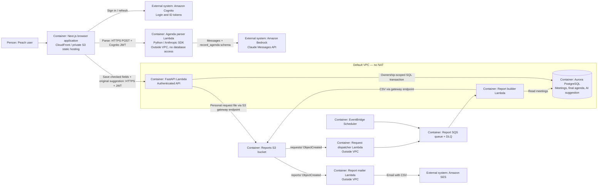

# Peach — container diagram (C4 level 2)

```mermaid
flowchart LR
    user[Person: Peach user]
    browser[Container: Next.js browser application\nCloudFront / private S3 static hosting]
    cognito[External system: Amazon Cognito\nLogin and ID tokens]
    parser[Container: Agenda parser Lambda\nPython / Anthropic SDK\nOutside VPC, no database access]
    bedrock[External system: Amazon Bedrock\nClaude Messages API]
    subgraph vpc[Default VPC — no NAT]
      api[Container: FastAPI Lambda\nAuthenticated API]
      db[(Container: Aurora PostgreSQL\nMeetings, final agenda, AI suggestion)]
      builder[Container: Report builder Lambda]
    end
    s3[Container: Reports S3 bucket]
    queue[Container: Report SQS queue + DLQ]
    schedule[Container: EventBridge Scheduler]
    mailer[Container: Report mailer Lambda\nOutside VPC]
    dispatch[Container: Request dispatcher Lambda\nOutside VPC]
    ses[External system: Amazon SES]
    user --> browser
    browser -->|Sign in / refresh| cognito
    browser -->|Parse: HTTPS POST + Cognito JWT| parser
    parser -->|Messages + record_agenda schema| bedrock
    browser -->|Save checked fields + original suggestion: HTTPS + JWT| api
    api -->|Ownership-scoped SQL transaction| db
    api -->|Personal request file via S3 gateway endpoint| s3
    s3 -->|requests/ ObjectCreated| dispatch
    dispatch --> queue
    schedule --> queue
    queue --> builder
    builder -->|Read meetings| db
    builder -->|CSV via gateway endpoint| s3
    s3 -->|reports/ ObjectCreated| mailer
    mailer -->|Email with CSV| ses
```

Only the parse path calls a model. Only the trusted API saves the checked agenda. Existing weekly reports keep their separate event-driven path.
